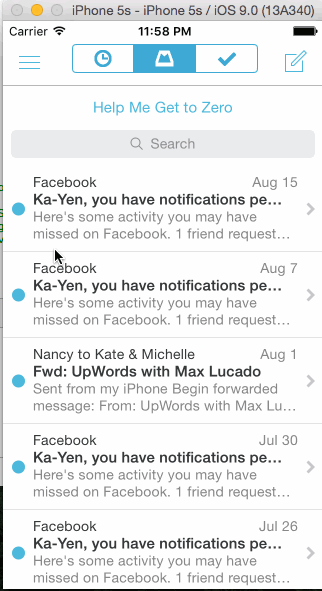

# Mailbox Homework for Codepath

The purpose of this app was to learn how to leverage animations and gestures

Time: I spent around 15 hours, but was not quite able to finish all the require tasks. 

## What can the app do?

* [x]  User can swipe the message left and encounter 3 points of interaction (and right, to encounter another 3 points of interaction). Message should disappear (to imitate being "cleared") but then return so the demo can continue.
* [x]  User can dismiss a reschedule view and a list view, when encountered.

Walkthrough of all the app stories:

 
The GIF was created with [LiceCap](http://www.cockos.com/licecap/).

